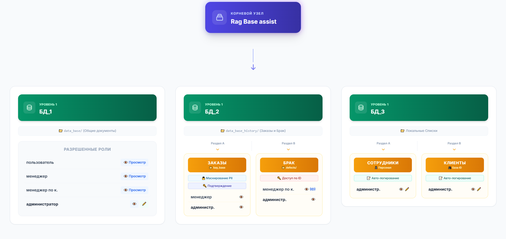

# 🗺️ Карта доступа Rag Base assist

**Интерактивная схема** — кто из сотрудников к каким документам и данным будет иметь доступ в умном ассистенте компании. Корпоративный ИИ с контролем доступа — как у внутренней CRM.

👉 **Открыть карту:** [ms7-maker.github.io/security-RAG-plan](https://ms7-maker.github.io/security-RAG-plan/)



> ⚠️ Это **план и визуализация**, а не готовая программа. Здесь показано, *как должна работать* система безопасности — до того, как её начнут разрабатывать.

---

## 🤔 Зачем это нужно

У компании есть документы разной важности и секретности:

- 📚 общие инструкции и FAQ (доставка, оплата);
- 📦 заказы клиентов;
- 🔍 отчёты о браке;
- 👥 списки сотрудников и клиентов.

**Rag Base assist** — это задумка умного помощника: он ищет ответы в документах и отвечает на вопросы с помощью ИИ. Но нельзя, чтобы каждый видел всё подряд.

Эта карта показывает:

- 👤 **кто** к чему допущен;
- 🔒 **какие защиты** включены;
- 🎯 **как должен вести себя** ассистент для каждой роли.

---

## 👥 Четыре роли

| Роль | | Что может делать |
|------|---|------------------|
| **Пользователь** | 👤 | Только общие документы: FAQ, условия доставки и оплаты |
| **Менеджер** | 💼 | Общие документы + заказы (имена и телефоны клиентов скрыты) |
| **Менеджер по качеству** | 🔍 | Общие документы + один отчёт о браке по конкретному номеру (ID) |
| **Администратор** | 🛡️ | Полный доступ: просмотр и правка списков сотрудников и клиентов |

**Обозначения на карте:**

- 👁️ — можно **смотреть**
- ✏️ — можно **редактировать**

---

## 📂 Три базы данных (папки с документами)

### БД_1 📚 — Общие документы

Папка `data_base/` — материалы для всех: FAQ, правила, условия работы.

Доступ: все четыре роли (только просмотр, кроме администратора — он может редактировать).

### БД_2 📦 — Заказы и брак

Папка `data_base_history/` — конфиденциальная информация. Два подраздела:

| Подраздел | Содержимое | Кто видит |
|-----------|------------|-----------|
| **ЗАКАЗЫ** (`bay_base`) | История заказов | Менеджер, администратор |
| **БРАК** (`defects/`) | Отчёты о браке | Менеджер по качеству (по ID), администратор |

### БД_3 📋 — Внутренние списки

Локальные справочники компании:

| Подраздел | Содержимое | Кто видит |
|-----------|------------|-----------|
| **Сотрудники** | Персонал | Только администратор |
| **Клиенты** | База ID клиентов | Только администратор |

---

## 🔐 Защиты (замки на дверях)

| Маркер | Что означает простыми словами |
|--------|-------------------------------|
| 🔒 **Маскирование** | В заказах имена, email и телефоны заменяются на `[Name]`, `[Email]`, `[Phone]` — ИИ не видит настоящие контакты |
| 🔑 **Доступ по ID** | Менеджер по качеству не может запросить «все отчёты о браке» — только один файл по конкретному номеру |
| 🔑 **Подтверждение (MFA)** | Для заказов и внутренних списков нужен дополнительный код (SMS, токен или согласие с регламентом) |
| 📝 **Журнал изменений** | Всё, что меняет администратор в списках сотрудников и клиентов, записывается навсегда — стереть нельзя |

---

## 🖱️ Как пользоваться интерактивной картой

1. Откройте [демо-страницу](https://ms7-maker.github.io/security-RAG-plan/).
2. **🌳 Диаграмма** — дерево: система → базы → роли.
3. **📋 Сводная матрица** — таблица «кто что может» в одном месте.
4. **🛡️ Безопасность и промпты** — подробные правила и цели для ИИ.
5. **👁️ Симуляция роли** — нажмите роль вверху страницы: недоступные блоки «погаснут», видно только то, что разрешено этой роли.

Дополнительно: в поле поиска можно ввести «менеджер» — подсветятся только строки с этой ролью.

---

## 🏗️ Если бы мы делали настоящую программу

Сейчас это схема. Если превратить её в рабочую систему, понадобятся такие части:

### 💬 Интерфейс для людей

- Окно чата с ассистентом (как ChatGPT, но внутри компании)
- Вход по логину и паролю
- Запрос кода подтверждения при доступе к заказам и спискам

### 📁 Хранилище документов

- Папки: общие FAQ, архив заказов, отчёты о браке, списки персонала
- Разные права: просмотр 👁️ и редактирование ✏️ в зависимости от роли

### 🧠 «Мозг» поиска (RAG)

- Индексация документов — чтобы быстро находить ответы по смыслу, а не только по словам
- Перед каждым ответом — проверка: имеет ли этот человек право читать найденный документ

### 🛡️ Фильтры безопасности

- Автоматическое скрытие персональных данных перед отправкой в ИИ
- Ограничение для менеджера по качеству: только один файл брака по ID
- Неудаляемый журнал всех правок администратора

### 🤖 ИИ-ассистент

- Разные инструкции (промпты) для каждой роли:
  - пользователь не сможет выведать имена сотрудников;
  - менеджер не увидит чужие заказы целиком;
  - менеджер по качеству не получит сводку по всем бракам;
  - администратор сможет сопоставлять данные, а каждое изменение попадёт в журнал.

### ⚙️ Администрирование

- Управление пользователями и ролями
- Просмотр журнала аудита
- Обновление документов в общей базе

**Упрощённая схема работы:**

```
Сотрудник → Вход и чат → Проверка роли и MFA → Допуск к документам
    → Маскирование личных данных → Умный поиск → Ответ ИИ

Администратор → Правки списков → Запись в журнал (навсегда)
```

---

## 👩‍💻 Для разработчиков

Проект — один HTML-файл (`index.html`), стили через Tailwind CDN, без сервера и установки.

**Локально:** откройте `index.html` в браузере.

Подробные правила безопасности и цели промптов — на вкладке **🛡️ Безопасность и промпты** в [интерактивной карте](https://ms7-maker.github.io/security-RAG-plan/).
